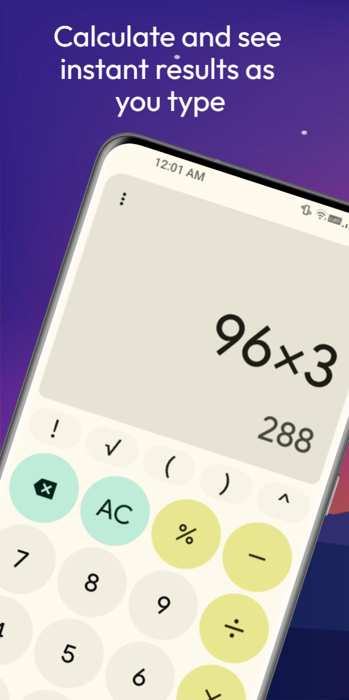
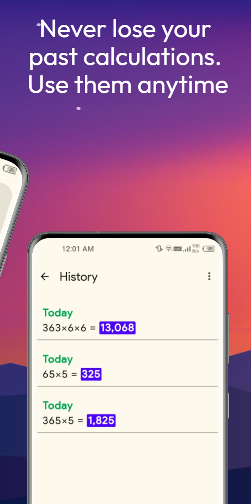
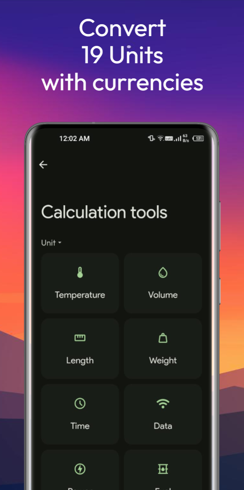
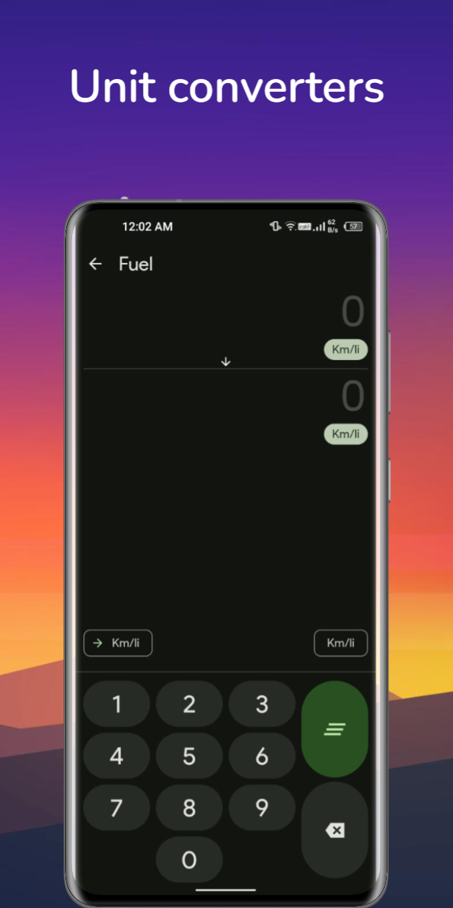

# CalcMaster 

This project is a clone of the settings app found on Google Pixel devices. It's built using Java for the backend logic and HTML, CSS, and JavaScript for the frontend interface. The app closely mimics the look and feel of the original Google Pixel settings app and includes functionality similar to the original, with some settings fully operational.

Features:

Responsive and user-friendly interface resembling the Google Pixel settings app.
Implemented backend logic in Java for handling various settings configurations.
Utilized HTML, CSS, and JavaScript for creating interactive frontend elements.
Some settings fully functional to provide a realistic experience.
Usage:

Clone the repository to your local machine.
Open the project in your preferred IDE.
Ensure you have Java installed to run the backend logic.
Contributing:
Contributions to improve the project are welcome! If you have any ideas for additional features, improvements, or bug fixes, feel free to open an issue or submit a pull request.

Credits:
This project was created by Pranshul.

Disclaimer:
This project is a clone and is not affiliated with or endorsed by Google or the Google Pixel brand. It's intended for educational and demonstration purposes only.
* Don't run the HTML files directly in your browser as it won't function properly. 

👌App is legit fr fr ✨

You can install the app on your device if you want to try it <a href='https://github.com/PranshulGG/CalcMaster_A_Calculator_App/releases/tag/calculator'>Here</a>

  

